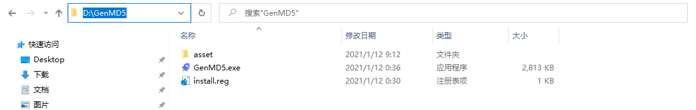
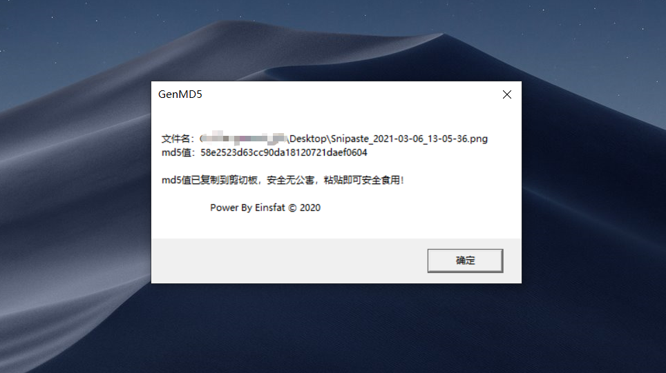

## 关于（About）
一个简单方便的md5计算工具
A simple and convenient md5 calculation tool

## 安装步骤（Installation）

1. 下载编译好的压缩文件: [点击下载](https://github.com/DaiLF/GenMD5/releases/tag/v1.0.0)
2. 解压 `GenMD5.zip` 
3. 将解压后的文件放到 `D` 盘根目录（目前尚不支持自定义安装，但是可以修改 `install.reg` 文件更改安装位置）

4. 使用`管理员`身份运行 `install.reg` 即可安装 

## 使用方法（Usage）
安装完成之后，选择需要计算 `md5` 的文件，鼠标右键选择 `GenMD5` 即可，计算结果弹窗展示，并自动复制到系统剪切板，在需要使用的位置直接 `Ctrl + V` 粘贴即可。

## 展示（Show）

